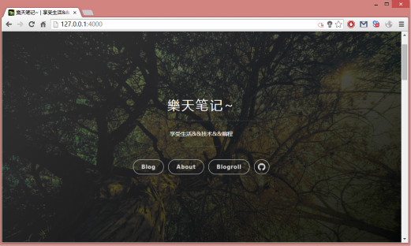
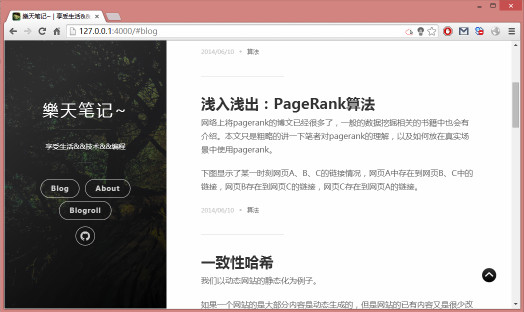
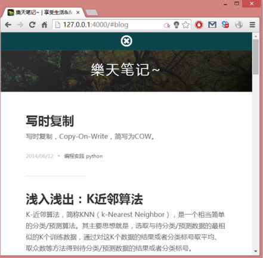
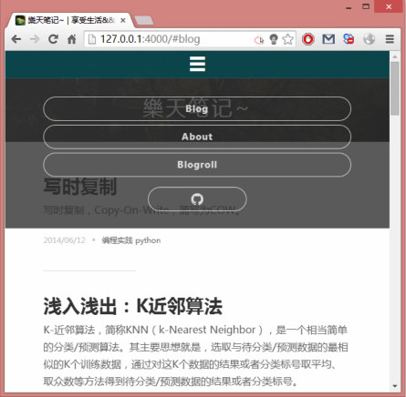

如果在中国大陆使用该主题后，访问速度变慢，可以考虑注释掉`source/css/uno.css`的第一行。


# Huno


Huno is a responsible theme for [Hexo], and it is based on [Uno].

[Uno] is a a minimal, responsive theme which is designed for [Ghost].


## Install

```
git clone git://github.com/someus/huno.git themes/huno
```

Huno performs well with Hexo 2.5.7.

## Enable
Please modify `theme` setting in `_config.yml` to `huno`.

## Update

```
cd themes/huno
git pull
```

## Configuration

	# Header
	menu:
	  Blog: /#blog
	  About: /about
	  Blogroll: /blogroll

	# Site favicon
	favicon: /favicon.png

	# Site logo
	logo: /avatar.png

	# Enable Fancybox
	fancybox: true


## Add Google analysis code
Switch your current directory to /{your}/{path}/{to}/{blog}/{archive}/{root}
######cd /themes/huno/layout/
Please add the code to `layout/layout.ejs`:

	<!--  google analytics -->
	<script>
	  // add your google analytics code here
	</script>

## Enable Disqus
**Should modify the '_config.yml' file under your blog root directory**

Please modify `disqus_shortname` setting in `_config.yml` to your disqus short name.

## Preview
The images below are in directory `demo`. When use the theme, please delete it!





[Hexo]: http://hexo.io/
[Uno]: https://github.com/daleanthony/uno/
[Fancybox]: http://fancyapps.com/fancybox/
[Ghost]: https://ghost.org/


## Q&A

###Question 1:

	   5|     <meta http-equiv="X-UA-Compatible" content="chrome=1">
	   6| 
	>> 7|     <%
	   8|     var title = page.title;
	   9|     var description = page.description || '';
	   10| 
	   
	   Cannot call method 'substring' of null

**Answer:**  
[https://github.com/someus/huno/issues/1](https://github.com/someus/huno/issues/1)
