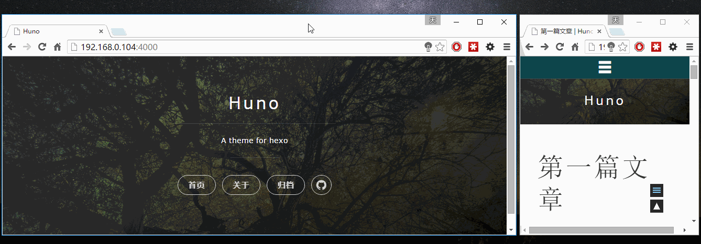

如果在中国大陆使用该主题后，访问速度变慢，可以考虑注释掉`source/css/uno.css`的第一行。


# Huno

Huno是为[Hexo](http://hexo.io/)编写的一个响应式的主题，该主题基于[Uno](https://github.com/daleanthony/uno/)。



## Demo

[Huno's demo](http://hi.letiantian.me/huno/)

## 安装

```plain
$ git clone git://github.com/someus/huno.git themes/huno
```

修改Hexo的配置文件`_config.xml`：
```plain
theme: huno
```

## 更新

```plain
$ cd themes/huno
$ git pull
```


## 兼容性
在Hexo 3.1.1测试正常。

## 配置示例

```yaml
# Header
menu:
  首页: /#blog
  关于: /about
  归档: /archive

# Site favicon
favicon: /favicon.png

# Site logo
# logo: /avatar.png

# Enable Mathjax
mathjax: true

# Enable awesome-toc
awesome_toc: true

# Enable githubRepoWidget
github_repo_widget: false
```

menu中定义`/#blog`是必须的，示例中的`/about`和`/archive`是两个页面。`/archive`会在下面的**归档页面**中介绍。

### mathjax
数学公式支持。其设置（layout/_scripts/mathjax.ejs）如下：
```
$(document).ready(function(){
    MathJax.Hub.Config({ 
        tex2jax: {inlineMath: [['[latex]','[/latex]'], ['\\(','\\)']]} 
    });
});
```

官网：[mathjax](https://www.mathjax.org/)


### awesome_toc
为文章生成目录。

官网：[awesome-toc](https://github.com/someus/awesome-toc)

## 归档页面
归档页面会显示分类、标签云以及基于日期的归档。

在主题的配置文件`_config.yml`中：
```yaml
# Header
menu:
  首页: /#blog
  关于: /about
  归档: /archive
```

创建新的page：
```plain
$ hexo new page archive
$ cd source/archive
$ vim index.md
```

内容修改为：
```
title: 归档
layout: page-archive
---
```

浏览器访问`http://127.0.0.1:4000/archive/`即可。

> !! hexo 默认有一个`/archives`，如果您认为归档页面的url（`/archive`）和这个冲突，可以选更加合适的名称:blush:。

### github_repo_widget
可视化显示github中的项目。

官网：[GitHub-jQuery-Repo-Widget](https://github.com/JoelSutherland/GitHub-jQuery-Repo-Widget)


## 评论
支持Disqus和多说，在Hexo配置文件`_config.yml`中设置名称即可，例如：
```yaml
# Disqus
disqus_shortname: letian

# Duoshuo
duoshuo_shortname: letian
```

> !!! 如果两个都设置，则两个评论工具都会显示。

## Social Icon
默认提供了Github的图标，Github用户名请在Hexo的配置文件`_config.yml`中配置，例如：
```yaml
# Social
social:
  github: someus
```

可以根据需要在`layout/_partials/social.ejs`中添加更多的图标。


## 网站统计
将网站统计（如Google analysis、CNZZ、百度统计等）代码放入`layout/_scripts/site-analytics.ejs`即可。

## 如何将Huno生成的静态网站放在某网站子目录

例如要将其放入`http://hi.letiantian.me/huno/`下，则需要：

#### 修改Hexo配置文件`_config.yml`
```yaml
# URL
## If your site is put in a subdirectory, set url as 'http://yoursite.com/child' and root as '/child/'
url: http://hi.letiantian.me/huno
root: /huno/
```

#### 修改主题的配置文件`_config.yml`
```yaml
# Header
menu:
  首页: /huno/#blog
  关于: /huno/about
  归档: /huno/archive

# Site favicon
favicon: /huno/favicon.png
```

#### 修改`huno/source/js/main.js`

将
```js
if (window.location.pathname != "/") {
  $('.panel-cover').addClass('panel-cover--collapsed');
}
```

修改为
```js
if (window.location.pathname != "/huno/") {
  $('.panel-cover').addClass('panel-cover--collapsed');
}
```

#### 修改`huno/layout/_partials/side-panel.ejs`
将
```plain
<% for (var i in theme.menu){ %>
  <%
    if (theme.menu[i]+'' == '/#blog') {
      nav_btn_class = 'blog-button';
    } else {
      nav_btn_class = '';
    }
  %>
```

修改为：

```plain
<% for (var i in theme.menu){ %>
  <%
    if (theme.menu[i]+'' == '/huno/#blog') {
      nav_btn_class = 'blog-button';
    } else {
      nav_btn_class = '';
    }
  %>
```